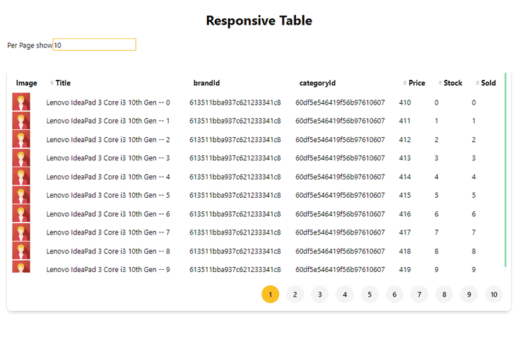

[](https://nodei.co/npm/rasel-react-table/)

# rasel-react-table

## Installation

Install `rasel-react-table` with [npm](https://www.npmjs.com/):

```
$ npm install rasel-react-table
```

## Usage

Very easy to use. Just provide props with columns and dataSource

```typescript jsx
import React, { Component } from "react";
import ReactDOM from "react-dom";
import {Table, Column} from "rasel-react-table";


const App  = ()=> {
    const columns: Column[] = [
        {
            title: "Image",
            dataIndex: "coverPhoto",
            render: (i: string) => ,
        },
        {
            title: "Title",
            dataIndex: "title",
            sorter: (a: string, b: string) => {
                return a.toLowerCase() > b.toLowerCase() ? 1 : a.toLowerCase() < b.toLowerCase() ? -1 : 0;
            },
        },
        {
            title: "brandId",
            dataIndex: "brandId",
        },
        {
            title: "categoryId",
            dataIndex: "categoryId",
        },
        {
            title: "Price",
            dataIndex: "price",
            sorter: (a: number, b: number) => {
                return a > b ? 1 : a < b ? -1 : 0;
            },
        },
        {
            title: "Stock",
            dataIndex: "qty",
            sorter: (a: number, b: number) => {
                return a > b ? 1 : a < b ? -1 : 0;
            },
        },
        {
            title: "Sold",
            dataIndex: "sold",
            sorter: (a: number, b: number) => {
                return a > b ? 1 : a < b ? -1 : 0;
            },
        },
    ];
    
    const [state, setState] = useState<any>({
        pageSize: 10,
        currentPage: 1,
    });
    
    // fake data
    const data = new Array(1000).fill(1).map((_, index) => ({
        title: "Lenovo IdeaPad 3 Core i3 10th Gen -- " + index,
        qty: index,
        sold: index,
        categoryId: "60df5e546419f56b97610607",
        price: Math.round(500 + Math.random() * 1000),
        brandId: "613511bba937c621233341c8",
        createdAt: "2011-08-04T11:55:16.887Z",
        coverPhoto: "",
    }));
    
    return (
        <div className="App p-4 md:p10">
        <h1 className="text-3xl my-6 text-center font-bold">Responsive Table</h1>
        <div>
            <label htmlFor="">Per Page show</label>
            <input
                type="text"
                className="border-2 border-amber-400"
                placeholder="show items"
                onChange={(e) => setState({ ...state, pageSize: e.target.value })}
            />
        </div>
        <div className="mt-10">
            <div className="card">
                <Table
                    fixed={true}
                    dataSource={data ? data : []}
                    scroll={{ x: 800, y: 450 }}
                    columns={columns}
                    pagination={{ pageSize: state.pageSize, currentPage: 1 }}
                />
                </div>
            </div>
        </div>
    );
}

ReactDOM.render(<App />, document.getElementById("root"));

```


Check [Live example](https://rasel-mahmud-dev.github.io/react-responsive-table)



## Params

| Name                 | Type                                      | Default | Description                                              |
|----------------------|-------------------------------------------|---------|----------------------------------------------------------|
| `className`          | String                                    | ""      | **Optional.** apply class in table element               |
| `fixed`              | Boolean                                   | false   | **Optional.** fixed props make table fixed header        |
| `pagination`         | { pageSize: Number, currentPage: Number } | {}      | **Optional.** For Pagination                             |
| `scroll`             | { x: Number, y: Number }                  | {}      | **Optional.** For Responsive vertically and horizontally |
| `columns`  | ColumnType                                |         | **Require** That export rasel-react-table                           |
| `dataSource` | Object[]                                  | ``     | **Require** {}[]                                         |
